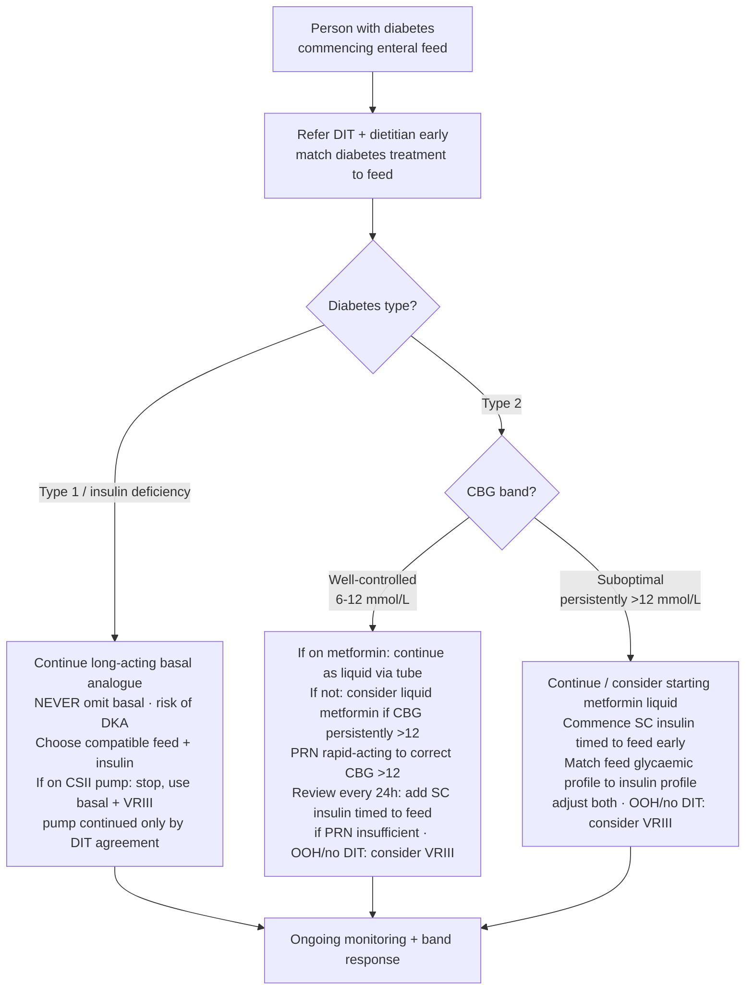

```mermaid
flowchart TD
    A[Person with diabetes<br/>commencing enteral feed] --> B[Refer DIT + dietitian early<br/>match diabetes treatment to feed]
    B --> C{Diabetes type?}
 
    C -->|Type 1 / insulin deficiency| T1[Continue long-acting basal analogue<br/>NEVER omit basal · risk of DKA<br/>Choose compatible feed + insulin<br/>If on CSII pump: stop, use basal + VRIII<br/>pump continued only by DIT agreement]
 
    C -->|Type 2| D{CBG band?}
    D -->|Well-controlled<br/>6-12 mmol/L| T2a[If on metformin: continue as liquid via tube<br/>If not: consider liquid metformin if CBG persistently >12<br/>PRN rapid-acting to correct CBG >12<br/>Review every 24h: add SC insulin timed to feed<br/>if PRN insufficient · OOH/no DIT: consider VRIII]
    D -->|Suboptimal<br/>persistently >12 mmol/L| T2b[Continue / consider starting metformin liquid<br/>Commence SC insulin timed to feed early<br/>Match feed glycaemic profile to insulin profile<br/>adjust both · OOH/no DIT: consider VRIII]
 
    T1 --> M[Ongoing monitoring + band response]
    T2a --> M
    T2b --> M
```
 
Sources: UHL Figure 1 and §2.2–2.6; JBDS §2.2–2.4, §4–6.
