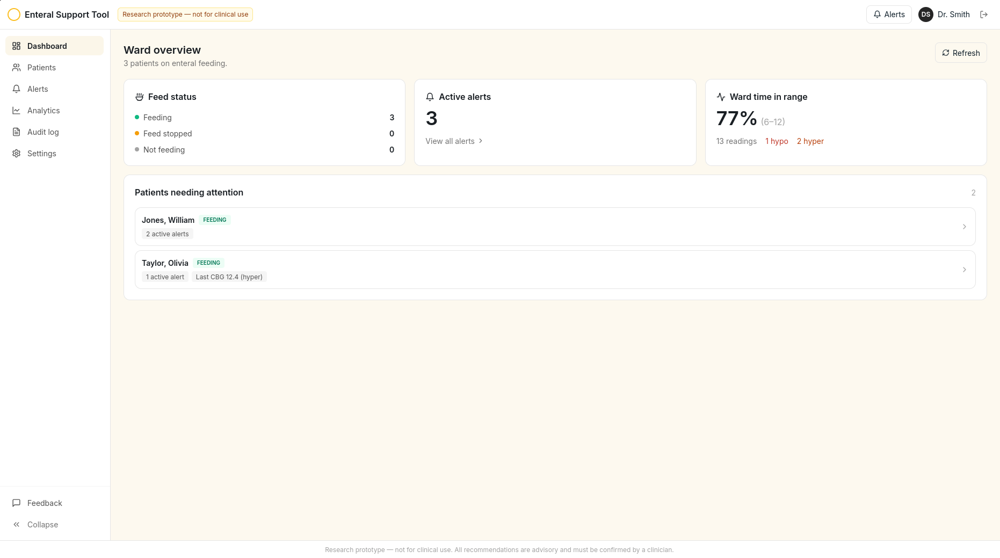
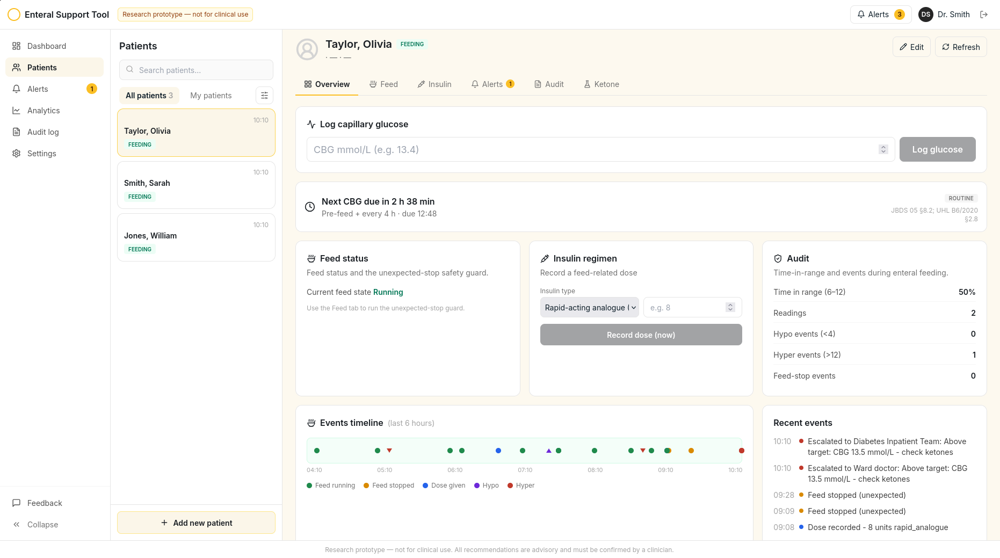

<div align="center">


# Enteral Feeding Tool
Managing enteral feeding for inpatients with diabetes, strictly adhering to University Hospitals of Leicester (UHL) protocols and Joint British Diabetes Societies (JBDS) guidelines.

#### [View Website](https://enteral-feeding.onrender.com/)
## PROTOTYPE - NOT FOR CLINICAL USE

</div>

## Contents
- [Features](#features)
- [Screenshots](#screenshots)
- [How to use](#how-to-use)
- [Tech Stack](#tech-stack)
- [Project Structure](#project-structure)
- [Contributions](#contributions)
- [Acknowledgements](#acknowledgments)


## Features

Advisory, human-in-the-loop decision support for blood glucose management in enteral-fed inpatients, grounded in UHL (B6/2020) and JBDS 05 guidelines. Every recommendation is traceable to its source section. Research prototype, not for clinical use.

- **CBG band classification and guidance** - classifies readings (hypo <4, target 6-12, above >12) with patient-category recommendations and provenance.
- **Feed-stop safety guard** - assesses hypo/ketosis risk when a feed stops, using an insulin-on-board model to withhold due doses and flag IV glucose.
- **Ketone / DKA workflow** - branches ketone readings and escalates to the FRIII / DKA pathway when raised.
- **Alerts and escalation** - high-risk events auto-raise alerts that climb nurse to doctor to DIT until acknowledged, with a who-saw-what trail.
- **Multi-patient roster** - per-patient data, MRN/ward/age details, and live feed-status badges.
- **Dashboard and audit** - time-in-range, hypo/hyper counts, an events timeline, and an append-only audit log.

**Design principles:** clinical rules live as data (YAML) not code, deterministic with no ML on the decision path, fully traceable, and backed by a test suite including the two JBDS case studies as runnable tests.


## Screenshots

<div align="center">
    
    <p> Enteral Support Tool Dashboard </p>
</div>

<div align="center">
    
    <p> Enteral Support Tool Patient View</p>
</div>


## How to use
[Link](https://enteral-feeding.onrender.com) to visit the prototype website

*Note: May take a minute for the backend to run (Running on a free webservice currently)*

To run this project locally as a developer, follow these steps:
```bash
git clone https://github.com/1102Aryan/enteral-feeding-tool
cd backend
python -m venv .venv
source .venv/bin/activate
pip install backend/requirements.txt -r
uvicorn app.main:app --reload --port 8000

# Open a new terminal for the frontend
cd frontend
npm install
npm run dev

```


## Tech Stack
### Frontend
- React 
- Tailwind CSS 
- Vite
### Backend
- Python
- FastAPI
- SQLModel
- PyTest


## Project Structure

```
enteral-feeding-tool/
├── backend/                  # Python
│   ├── app/                  # Main application code
│   ├── rules/                # JBDS and UHL clinical logic rules engines
│   ├── tests/                # Pytest test suites
│   ├── requirements.txt      # Backend dependencies
│   └── pytest.ini            # Pytest configuration
├── frontend/                 # React frontend application
│   ├── src/                  # React components and views
│   ├── public/               # Static assets
│   ├── package.json          # Frontend dependencies
│   └── tailwind.config.js    # Tailwind configuration
├── images/                   # images
└── README.md

```


## Acknowledgments
- University Hospitals of Leicester (UHL): For local Trust protocols and guidance.

- Joint British Diabetes Societies (JBDS): Specifically the JBDS-05 guidelines for glycemic management during enteral feeding.


## Contributions
Thanks for visiting this repository. Contributions are welcome! Feel free to submit a PR.


<div align="center">

[Report Bug](https://github.com/1102Aryan/enteral-feeding-tool/issues) • [Request Feature](https://github.com/1102Aryan/interal-feeding-tool/issues)

</div>
